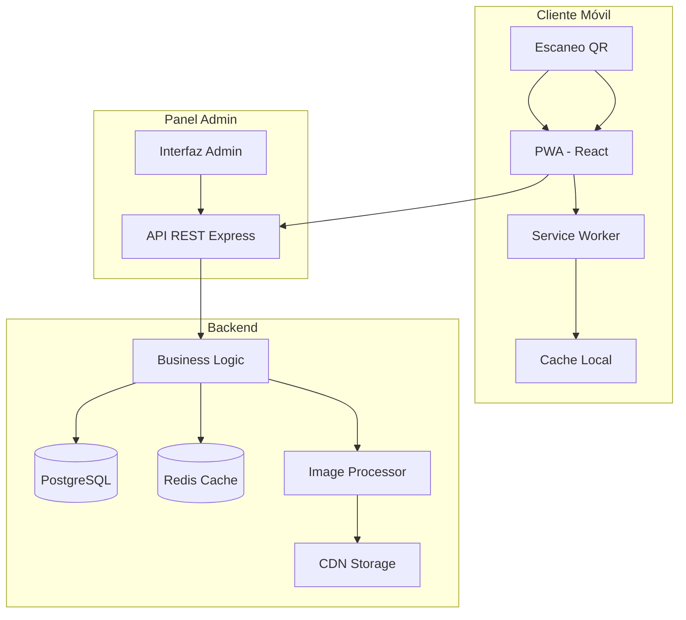

# Documento de Diseño Técnico - Sistema de Menú Digital QR

## Overview

El sistema de menú digital QR es una Progressive Web App (PWA) que permite a los restaurantes ofrecer sus menús de forma digital mediante códigos QR. Los clientes escanean el código QR en las mesas y acceden instantáneamente al menú en sus dispositivos móviles sin necesidad de instalar aplicaciones. Los administradores del restaurante pueden gestionar el contenido del menú a través de un panel de administración web.

### Objetivos del Sistema

- Proporcionar acceso instantáneo al menú mediante códigos QR
- Ofrecer una experiencia de usuario fluida y responsive en dispositivos móviles
- Permitir gestión sencilla del contenido del menú por parte de administradores
- Garantizar rendimiento óptimo incluso con conexiones lentas
- Funcionar offline después de la carga inicial mediante capacidades PWA

### Stack Tecnológico

**Frontend:**
- React 18 con TypeScript para type safety
- Vite como build tool para desarrollo rápido y optimización
- Tailwind CSS para estilos responsive y consistentes
- Workbox para service worker y capacidades PWA

**Backend:**
- Node.js con Express para API REST
- Multer para manejo de uploads de imágenes
- Sharp para procesamiento y optimización de imágenes
- QRCode library para generación de códigos QR

**Base de Datos:**
- PostgreSQL para almacenamiento persistente
- Redis para caché de sesiones y datos frecuentes

**Infraestructura:**
- CDN para servir imágenes optimizadas
- Service Worker para caché offline
- Compresión gzip/brotli para assets

## Architecture

### Arquitectura General

El sistema sigue una arquitectura cliente-servidor con tres capas principales:



### Flujo de Datos Principal

**Flujo Cliente (Visualización del Menú):**
1. Cliente escanea código QR → URL del menú
2. PWA carga desde cache si está disponible (offline-first)
3. Si online, solicita datos actualizados al API
4. Service Worker intercepta requests y aplica estrategia de cache
5. Imágenes se cargan lazy desde CDN
6. Datos se cachean localmente para acceso offline

**Flujo Administrador (Gestión de Contenido):**
1. Admin se autentica en panel de administración
2. Realiza operaciones CRUD sobre menú/categorías/items
3. API valida y procesa la solicitud
4. Si hay imágenes, se procesan y optimizan
5. Datos se guardan en PostgreSQL
6. Cache de Redis se invalida
7. Clientes reciben actualizaciones en próxima sincronización

### Estrategia de Caché

**Service Worker Strategy:**
- **Stale-While-Revalidate** para datos del menú: muestra cache inmediatamente, actualiza en background
- **Cache-First** para imágenes: prioriza cache, fallback a red
- **Network-First** para panel admin: siempre intenta red primero

**Cache Layers:**
1. Browser Cache (HTTP headers)
2. Service Worker Cache (PWA)
3. Redis Cache (backend)
4. CDN Cache (imágenes)

## Components and Interfaces

### Frontend Components

#### Cliente (PWA)

**MenuPage**
- Componente principal que orquesta la visualización del menú
- Maneja estado de carga y errores
- Implementa scroll infinito si el menú es extenso

**CategoryList**
- Renderiza lista de categorías
- Permite navegación rápida entre secciones
- Sticky header para acceso rápido

**CategorySection**
- Muestra items de una categoría específica
- Agrupa items por disponibilidad

**MenuItem**
- Card individual para cada item del menú
- Props: `{ id, name, description, price, imageUrl, available }`
- Lazy loading de imágenes con placeholder
- Indicador visual para items no disponibles

**RestaurantHeader**
- Logo y nombre del restaurante
- Información de contacto y horarios
- Diseño responsive

**LoadingSpinner**
- Indicador de carga durante fetch inicial

**OfflineIndicator**
- Banner que indica cuando se muestra contenido cacheado

#### Panel de Administración

**AdminDashboard**
- Vista principal del panel admin
- Navegación entre secciones

**MenuManager**
- CRUD completo para items del menú
- Drag & drop para reordenar items

**CategoryManager**
- CRUD para categorías
- Reordenamiento de categorías

**ItemForm**
- Formulario para crear/editar items
- Upload de imágenes con preview
- Validación de campos requeridos

**QRGenerator**
- Genera código QR del menú
- Permite descarga en alta resolución
- Preview del código generado

**ImageUploader**
- Componente reutilizable para upload de imágenes
- Preview antes de subir
- Validación de formato y tamaño

### Backend API Endpoints

#### Endpoints Públicos (Cliente)

```
GET /api/menu/:restaurantId
Response: {
  restaurant: {
    id: string,
    name: string,
    logo: string,
    hours: string,
    contact: string
  },
  categories: [
    {
      id: string,
      name: string,
      order: number,
      items: [
        {
          id: string,
          name: string,
          description: string,
          price: number,
          imageUrl: string,
          available: boolean,
          order: number
        }
      ]
    }
  ]
}
```

#### Endpoints Admin (Autenticados)

```
POST /api/admin/auth/login
Body: { email, password }
Response: { token, user }

GET /api/admin/menu
Response: { categories, items }

POST /api/admin/items
Body: { name, description, price, categoryId, image? }
Response: { item }

PUT /api/admin/items/:id
Body: { name?, description?, price?, categoryId?, available?, image? }
Response: { item }

DELETE /api/admin/items/:id
Response: { success: boolean }

POST /api/admin/categories
Body: { name, order }
Response: { category }

PUT /api/admin/categories/:id
Body: { name?, order? }
Response: { category }

DELETE /api/admin/categories/:id
Response: { success: boolean }

PUT /api/admin/items/:id/reorder
Body: { newOrder: number }
Response: { success: boolean }

PUT /api/admin/categories/:id/reorder
Body: { newOrder: number }
Response: { success: boolean }

POST /api/admin/qr/generate
Response: { qrCodeUrl, downloadUrl }

POST /api/admin/images/upload
Body: FormData with image file
Response: { imageUrl, thumbnailUrl }
```

### Service Layer

**MenuService**
- `getMenuByRestaurantId(restaurantId)`: Obtiene menú completo con cache
- `invalidateMenuCache(restaurantId)`: Invalida cache cuando hay cambios

**ItemService**
- `createItem(data)`: Crea nuevo item con validación
- `updateItem(id, data)`: Actualiza item existente
- `deleteItem(id)`: Elimina item (soft delete)
- `toggleAvailability(id, available)`: Cambia disponibilidad
- `reorderItem(id, newOrder)`: Reordena item en categoría

**CategoryService**
- `createCategory(data)`: Crea nueva categoría
- `updateCategory(id, data)`: Actualiza categoría
- `deleteCategory(id)`: Elimina categoría (verifica que esté vacía)
- `reorderCategory(id, newOrder)`: Reordena categoría

**ImageService**
- `uploadImage(file)`: Procesa y sube imagen
- `optimizeImage(file)`: Genera versiones optimizadas (thumbnail, mobile, desktop)
- `deleteImage(url)`: Elimina imagen del storage

**QRService**
- `generateQR(restaurantId)`: Genera código QR con URL del menú
- `generateHighResQR(restaurantId)`: Genera QR en 300 DPI para impresión

**AuthService**
- `login(email, password)`: Autentica administrador
- `verifyToken(token)`: Valida JWT token
- `hashPassword(password)`: Hash de contraseñas con bcrypt

## Data Models

### Database Schema (PostgreSQL)

```sql
-- Tabla de restaurantes
CREATE TABLE restaurants (
  id UUID PRIMARY KEY DEFAULT gen_random_uuid(),
  name VARCHAR(255) NOT NULL,
  logo_url TEXT,
  hours TEXT,
  contact_info JSONB,
  created_at TIMESTAMP DEFAULT NOW(),
  updated_at TIMESTAMP DEFAULT NOW()
);

-- Tabla de categorías
CREATE TABLE categories (
  id UUID PRIMARY KEY DEFAULT gen_random_uuid(),
  restaurant_id UUID NOT NULL REFERENCES restaurants(id) ON DELETE CASCADE,
  name VARCHAR(255) NOT NULL,
  display_order INTEGER NOT NULL DEFAULT 0,
  created_at TIMESTAMP DEFAULT NOW(),
  updated_at TIMESTAMP DEFAULT NOW(),
  UNIQUE(restaurant_id, display_order)
);

-- Índice para ordenamiento
CREATE INDEX idx_categories_order ON categories(restaurant_id, display_order);

-- Tabla de items del menú
CREATE TABLE menu_items (
  id UUID PRIMARY KEY DEFAULT gen_random_uuid(),
  category_id UUID NOT NULL REFERENCES categories(id) ON DELETE CASCADE,
  name VARCHAR(255) NOT NULL,
  description TEXT,
  price DECIMAL(10, 2) NOT NULL,
  image_url TEXT,
  thumbnail_url TEXT,
  available BOOLEAN DEFAULT true,
  display_order INTEGER NOT NULL DEFAULT 0,
  created_at TIMESTAMP DEFAULT NOW(),
  updated_at TIMESTAMP DEFAULT NOW(),
  UNIQUE(category_id, display_order)
);

-- Índice para ordenamiento y disponibilidad
CREATE INDEX idx_items_order ON menu_items(category_id, available DESC, display_order);

-- Tabla de administradores
CREATE TABLE admins (
  id UUID PRIMARY KEY DEFAULT gen_random_uuid(),
  restaurant_id UUID NOT NULL REFERENCES restaurants(id) ON DELETE CASCADE,
  email VARCHAR(255) NOT NULL UNIQUE,
  password_hash VARCHAR(255) NOT NULL,
  name VARCHAR(255) NOT NULL,
  created_at TIMESTAMP DEFAULT NOW(),
  updated_at TIMESTAMP DEFAULT NOW()
);

-- Tabla de códigos QR generados
CREATE TABLE qr_codes (
  id UUID PRIMARY KEY DEFAULT gen_random_uuid(),
  restaurant_id UUID NOT NULL REFERENCES restaurants(id) ON DELETE CASCADE,
  qr_image_url TEXT NOT NULL,
  created_at TIMESTAMP DEFAULT NOW()
);
```

### TypeScript Interfaces

```typescript
interface Restaurant {
  id: string;
  name: string;
  logoUrl?: string;
  hours?: string;
  contactInfo?: {
    phone?: string;
    email?: string;
    address?: string;
  };
  createdAt: Date;
  updatedAt: Date;
}

interface Category {
  id: string;
  restaurantId: string;
  name: string;
  displayOrder: number;
  items?: MenuItem[];
  createdAt: Date;
  updatedAt: Date;
}

interface MenuItem {
  id: string;
  categoryId: string;
  name: string;
  description?: string;
  price: number;
  imageUrl?: string;
  thumbnailUrl?: string;
  available: boolean;
  displayOrder: number;
  createdAt: Date;
  updatedAt: Date;
}

interface Admin {
  id: string;
  restaurantId: string;
  email: string;
  name: string;
  createdAt: Date;
  updatedAt: Date;
}

interface QRCode {
  id: string;
  restaurantId: string;
  qrImageUrl: string;
  createdAt: Date;
}

interface MenuResponse {
  restaurant: Restaurant;
  categories: (Category & { items: MenuItem[] })[];
}
```

### Cache Data Structures (Redis)

```
Key Pattern: menu:{restaurantId}
Value: JSON string of MenuResponse
TTL: 300 seconds (5 minutes)

Key Pattern: session:{token}
Value: JSON string of Admin session
TTL: 86400 seconds (24 hours)
```


## Correctness Properties

*A property is a characteristic or behavior that should hold true across all valid executions of a system-essentially, a formal statement about what the system should do. Properties serve as the bridge between human-readable specifications and machine-verifiable correctness guarantees.*

### Property 1: Invalid restaurant IDs return appropriate errors

*For any* invalid or non-existent restaurant ID, requesting the menu should return an error response with a descriptive error message and appropriate HTTP status code (404).

**Validates: Requirements 1.4**

### Property 2: Menu items are grouped by category

*For any* restaurant menu with multiple categories and items, the API response should group all items under their respective categories, and every item should appear exactly once under its assigned category.

**Validates: Requirements 2.1**

### Property 3: Menu response contains all required fields

*For any* menu item in the response, the required fields (id, name, price, available) must be present, and optional fields (description, imageUrl) must be present when they exist in the database.

**Validates: Requirements 2.2, 3.1**

### Property 4: Image optimization reduces file size

*For any* uploaded image, the optimized versions (thumbnail, mobile) should have smaller file sizes than the original while maintaining acceptable quality, and all generated images should be in web-optimized formats.

**Validates: Requirements 3.2, 9.2**

### Property 5: CRUD operations round-trip correctly

*For any* valid menu item data, creating an item via the admin API and then retrieving it via the public menu API should return the same data, and updates to items should be immediately reflected in subsequent menu queries.

**Validates: Requirements 4.1, 4.2, 4.3, 4.4**

### Property 6: Item validation rejects invalid data

*For any* item creation or update request missing required fields (name or price), the system should reject the request with a validation error and not persist any changes to the database.

**Validates: Requirements 4.5**

### Property 7: Category creation and assignment

*For any* valid category name, creating a category should succeed, and items can be assigned to that category such that querying the menu returns those items under the correct category.

**Validates: Requirements 5.1, 5.2**

### Property 8: Reordering preserves all elements

*For any* list of categories or items within a category, reordering the elements should preserve all elements (no additions or deletions), and subsequent queries should return elements in the new order.

**Validates: Requirements 5.3, 5.4**

### Property 9: Availability toggle round-trip

*For any* menu item, marking it as unavailable and then marking it as available again should restore it to the available state, and the availability status should be accurately reflected in menu queries.

**Validates: Requirements 6.1, 6.3**

### Property 10: Available items appear before unavailable items

*For any* category containing both available and unavailable items, the menu response should list all available items before any unavailable items, maintaining the display order within each availability group.

**Validates: Requirements 6.2, 6.4**

### Property 11: Restaurant information completeness

*For any* restaurant, the menu response should include all restaurant fields that exist in the database (name, logo, hours, contact info), and required fields (name) must always be present.

**Validates: Requirements 7.1, 7.2, 7.3, 7.4**

### Property 12: QR code generation produces valid codes

*For any* restaurant ID, generating a QR code should produce a valid PNG image with minimum 300 DPI resolution, and decoding the QR code should yield the correct menu URL for that restaurant.

**Validates: Requirements 8.1, 8.2, 8.3, 8.4**

## Error Handling

### Error Categories

**Client Errors (4xx):**
- **400 Bad Request**: Invalid input data, validation failures
- **401 Unauthorized**: Missing or invalid authentication token
- **403 Forbidden**: Authenticated but insufficient permissions
- **404 Not Found**: Restaurant, category, or item not found
- **409 Conflict**: Duplicate category names, ordering conflicts

**Server Errors (5xx):**
- **500 Internal Server Error**: Unexpected server errors
- **503 Service Unavailable**: Database or external service unavailable

### Error Response Format

All API errors follow a consistent format:

```typescript
interface ErrorResponse {
  error: {
    code: string;           // Machine-readable error code
    message: string;        // Human-readable error message
    details?: any;          // Additional error context
    timestamp: string;      // ISO 8601 timestamp
  }
}
```

### Error Handling Strategies

**Frontend (PWA):**
- Network errors: Show cached content with offline indicator
- 404 errors: Display "Menu not found" message with QR code verification instructions
- 5xx errors: Show "Service temporarily unavailable" with retry button
- Image load failures: Display placeholder image
- Validation errors: Show inline form validation messages

**Backend API:**
- Database connection failures: Retry with exponential backoff, return 503 if exhausted
- Image processing failures: Log error, return 500, cleanup partial uploads
- Validation failures: Return 400 with detailed field-level errors
- Authentication failures: Return 401 with clear message
- Not found errors: Return 404 with resource type and ID

**Service Worker:**
- Failed cache writes: Log warning, continue without caching
- Failed network requests: Serve from cache if available
- Cache storage full: Implement LRU eviction strategy

### Logging and Monitoring

- All errors logged with context (user ID, request ID, stack trace)
- Critical errors trigger alerts (database down, high error rate)
- Error metrics tracked: error rate by endpoint, error types, response times
- Client-side errors reported to backend for monitoring

## Testing Strategy

### Dual Testing Approach

The system will employ both unit testing and property-based testing to ensure comprehensive coverage:

**Unit Tests** focus on:
- Specific examples demonstrating correct behavior
- Edge cases (empty menus, single item, maximum items)
- Error conditions (invalid inputs, missing data, network failures)
- Integration points between components
- Authentication and authorization flows

**Property-Based Tests** focus on:
- Universal properties that hold for all inputs
- CRUD operations with randomly generated data
- Data integrity across operations
- API contract compliance
- Round-trip properties (serialize/deserialize, create/read)

### Property-Based Testing Configuration

**Framework Selection:**
- **Frontend**: fast-check (TypeScript/JavaScript property testing library)
- **Backend**: fast-check for Node.js API tests

**Test Configuration:**
- Minimum 100 iterations per property test
- Seed-based randomization for reproducibility
- Shrinking enabled to find minimal failing cases
- Each property test tagged with reference to design document

**Tag Format:**
```typescript
// Feature: menu-digital-qr, Property 1: Invalid restaurant IDs return appropriate errors
test('invalid restaurant IDs return 404 errors', async () => {
  await fc.assert(
    fc.asyncProperty(fc.uuid(), async (invalidId) => {
      const response = await api.getMenu(invalidId);
      expect(response.status).toBe(404);
      expect(response.body.error.code).toBe('RESTAURANT_NOT_FOUND');
    }),
    { numRuns: 100 }
  );
});
```

### Unit Testing Strategy

**Frontend Components:**
- Test rendering with mock data
- Test user interactions (clicks, scrolls)
- Test loading and error states
- Test responsive behavior at key breakpoints
- Snapshot tests for visual regression

**Backend API:**
- Test each endpoint with valid inputs
- Test authentication middleware
- Test validation logic
- Test error handling paths
- Test database transactions

**Services:**
- Test business logic with specific examples
- Test image processing with sample images
- Test QR generation with known inputs
- Test cache invalidation

### Integration Testing

- End-to-end tests for critical user flows:
  - Client scans QR → views menu → sees all items
  - Admin logs in → creates item → item appears in menu
  - Admin uploads image → image is optimized → image loads in menu
  - Client loads menu → goes offline → menu still accessible

### Performance Testing

- Load testing: Simulate 1000 concurrent users viewing menu
- Image optimization: Verify processing time < 5 seconds per image
- API response time: Verify p95 < 500ms for menu endpoint
- PWA metrics: Verify Time to Interactive < 3 seconds on 3G

### Testing Tools

- **Unit/Property Testing**: Jest + fast-check
- **E2E Testing**: Playwright or Cypress
- **API Testing**: Supertest
- **Performance Testing**: k6 or Artillery
- **Visual Testing**: Percy or Chromatic
- **Accessibility Testing**: axe-core

### Test Coverage Goals

- Unit test coverage: > 80% for business logic
- Property test coverage: All 12 correctness properties implemented
- E2E test coverage: All critical user flows
- API test coverage: All endpoints with success and error cases

### Continuous Integration

- All tests run on every pull request
- Property tests run with fixed seed for consistency
- Performance tests run nightly
- E2E tests run on staging environment before production deploy
- Test results reported in PR comments

